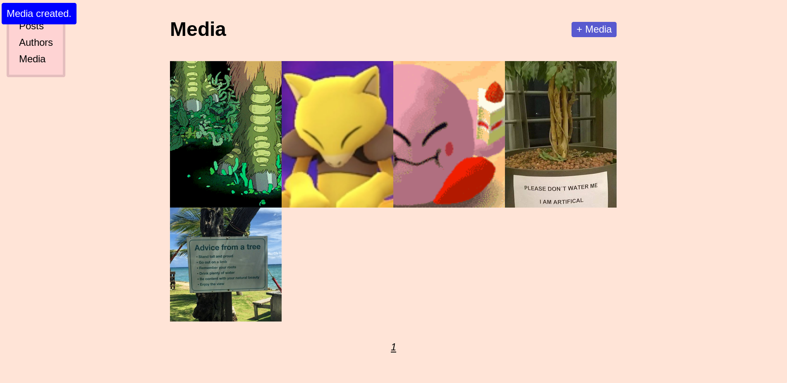

A simple Flask-based CMS.

You write `Posts` which are associated with `Issues`, have one or more `Authors` and have associated `Media`. You can also create `Events` that are also linked to `Issues`. `Posts`, `Authors`, and `Issues` also support arbitrary metadata; see below.

In combination with [`konbini`](https://github.com/frnsys/konbini) you can handle print subscriptions (plus other merch) as well.

There is no paywall support.

## Setup

First, setup your project directory, e.g. `my_blog`.

### Installation

Development is still happening sporadically, and this isn't available on `pip` yet, so you'll need to install from git:

    pip install -U git+https://github.com/frnsys/taozi

### Configuration

Create your config file, `my_blog/config.py`, according to the following template:

```
SECRET_KEY = 'something-secret'

SQLALCHEMY_DATABASE_URI = 'sqlite:////home/ftseng/myblog/myblog.db'
SQLALCHEMY_TRACK_MODIFICATIONS = False

SECURITY_PASSWORD_HASH = 'bcrypt'
SECURITY_PASSWORD_SALT = 'another-secret'
SECURITY_CHANGEABLE = True
SECURITY_RECOVERABLE = True

MAIL_SERVER = 'smtp.mailgun.org'
MAIL_USERNAME = 'postmaster@foo.mailgun.org'
MAIL_PASSWORD = 'your-password'
MAIL_PORT = 587
MAIL_USE_TLS = True
MAIL_DEBUG = True
MAIL_DEFAULT_SENDER = 'foo@foo.co'

# Don't forget to create this folder
UPLOAD_FOLDER = '/home/ftseng/myblog/uploads/'
MAX_CONTENT_LENGTH = 10 * 1024 * 1024 # 8MB

# Optional
ISSUE_META = {
    'edition': str,
    'color': str,
    'store_url': str
}

# Optional
AUTHOR_META = {
    'twitter': str,
    'nice': bool
}

# Optional
POST_META = {
    'moon_phase': str
}
```

### Setup your application

Create an app script, `myblog/app.py`, with at least the following:

```python
import config
from taozi import create_app
app = create_app(config, name='myblog')

if __name__ == '__main__':
    app.run(host='0.0.0.0', port=8000)
```

Here you can add additional Flask extensions, configure Sentry, add your own blueprints, and so on. An example of the latter:

```python
import config
from taozi import create_app
from flask import Blueprint, render_template

bp = Blueprint('myblog', __name__)
@bp.route('/')
def index():
    return render_template('helloworld.html')

app = create_app(config, name='myblog', blueprints=[bp])

if __name__ == '__main__':
    app.run(host='0.0.0.0', port=8000)
```

User-supplied blueprints take priority, so you can override default routes.

Setup your own templates and static files in `static` and `templates` (by default).

### Create an admin

To create the admin role:

    flask roles create admin

To create a user and make them an admin:

    flask users create <EMAIL>
    flask users activate <EMAIL>
    flask roles add <EMAIL> admin

The login at `/login` and access the admin backend at `/admin`.

## Demo

To run a demo application, follow the setup instructions above, then run `python app.py`
